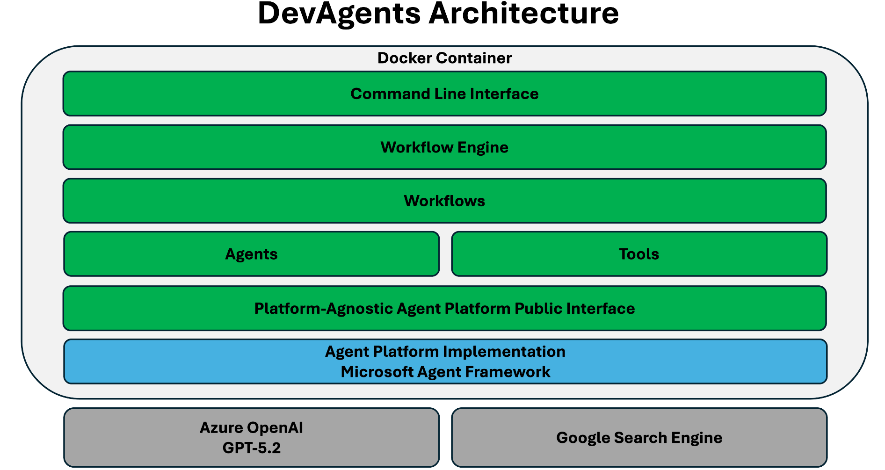

# Welcome to DevAgents!

DevAgents is an **experimental** project for using a team of AI agents for generating code or even create complete applications.

DevAgents uses a workflow-based approach. There are workflows for different development tasks. DevAgents aims to complete all workflows autonomously.

The workflows that are currently supported are listed in the table below.

| **Workflow**      | **Description**                                                                                     |
|-------------------|-----------------------------------------------------------------------------------------------------|
| NewCode           | A workflow for generating one or more code files, e.g., specific classes, modules, scripts, etc.|
| ModifyCode        | A workflow for modifying one or more code files, e.g., specific classes, modules, scripts, etc.|
| NewApp            | A workflow for generating complete applications. In a NewApp workflow, the application will be built and tested by specialized agents. In this workflow, LLM context size is the only limitation for an application to create. |
| ModifyApp         | A workflow for modifying existing applications. In a ModifyApp workflow, the application will be rebuilt and retested after modifications by specialized agents. |
| FixBuild          | A workflow to ensure an application builds successfully. Build errors will be fixed if necessary. |
| FixTests          | A workflow to ensure all tests pass successfully. Tests will be fixed if necessary. |

DevAgents uses a platform-agnostic abstraction layer for agent orchestration, allowing for flexibility in the underlying AI framework. The current internal implementation uses [Microsoft Agent Framework](https://github.com/microsoft/agent-framework), but the architecture enables swapping to alternative frameworks without impacting workflows or agents.

## DevAgents Architecture

DevAgents architecture is illustrated in the diagram below.




## How to Run Workflows with DevAgents

To run workflows with DevAgents, use the following command:

```bash
python -m cli.devagents.py [--workflow <workflowName>] [--prompt <prompt>] [--workspace <workspace>]
```

When DevAgents starts, you will be asked to enter missing command line arguments. You can give a prompt as a raw prompt or as a file path to a file containing a prompt. A workspace is a directory where DevAgents operates when processing a coding task specified by the given prompt.

Generated or modified code and other artifacts are saved in the given workspace.

DevAgents is available in a Docker container. The container defines the following aliases for starting workflows more easily.

| **Alias**   | **Definition**                       | **Description**              |
|-------------|--------------------------------------|------------------------------|
| devagents   | python -m cli.devagents              | Starts DevAgents             |
| new-code    | devagents --workflow NewCode         | Starts a NewCode workflow    |
| modify-code | devagents --workflow ModifyCode      | Starts a ModifyCode workflow |
| new-app     | devagents --workflow NewApp          | Starts a NewApp workflow     |
| modify-app  | devagents --workflow ModifyApp       | Starts a ModifyApp workflow  |
| fix-build   | devagents --workflow FixBuild        | Starts a FixBuild workflow   |
| fix-tests   | devagents --workflow FixTests        | Starts a FixTests workflow   |
| ver         | python -m cli.hello                  | Prints the DevAgents version |


## Configuration

To run DevAgents, you have to set the following environment variables in a `.env` file.

| Environment variable | Description                                                                                     |
|----------------------|-------------------------------------------------------------------------------------------------|
| AZURE_MODEL          | Azure LLM model name                                                                            |
| AZURE_API_KEY        | Azure API key for LLM calls                                                                     |
| AZURE_ENDPOINT       | Azure OpenAI endpoint to use                                                                    |
| AZURE_DEPLOYMENT     | Azure OpenAI model deployment name                                                              |
| AZURE_API_VERSION    | Azure API version to use                                                                        |
| GOOGLE_API_KEY       | Google API key (optional, if not given, real time google searches are not available for agents) |
| GOOGLE_CSE_ID        | Google Custom Search Engine ID (optional, see above)                                            |

Below is a sample of a content of a `.env` file.

```bash
AZURE_MODEL=gpt-4.1
AZURE_ENDPOINT=https://<your-openai-name>.openai.azure.com/
AZURE_API_KEY=35RpgJ******************************************************************************
AZURE_DEPLOYMENT=gpt-41
AZURE_API_VERSION=2024-12-01-preview
GOOGLE_API_KEY=AIza***********************************
GOOGLE_CSE_ID=3fc2************
```


## License

This project is licensed under the MIT License. See the `LICENSE` file for details.


## Remarks

- DevAgents has been tested with Azure OpenAI Service using GPT-5.2.
- Always carefully review and test all code written by AI - this is valid for all tools, not just DevAgents.


## Further Information

- [Developer Guide](docs/developer-guide.md)


---
Happy prompting with DevAgents! 🚀
